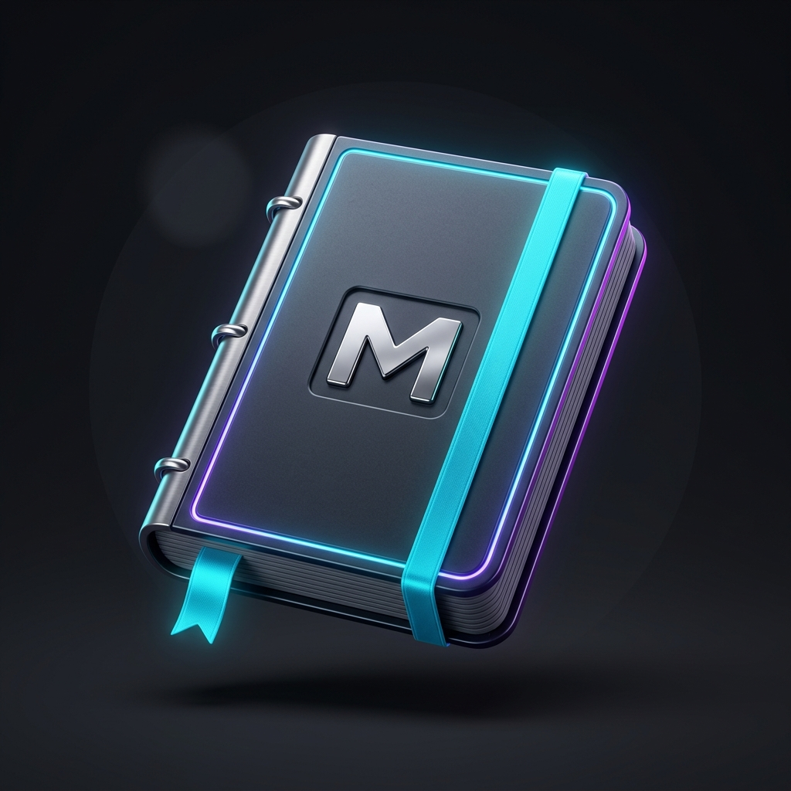

# Sidebar Notes for VS Code

<p align="center">
  
</p>

<p align="center">
  <strong>Fast, beautiful, offline-first Markdown notes directly inside VS Code's sidebar.</strong><br>
  <em>Zero clutter. Zero proprietary databases. Full native power.</em>
</p>

<p align="center">
  <a href="https://marketplace.visualstudio.com/items?itemName=iiMuhammadRashed.sidebar-notes"></a>
  <a href="https://github.com/iiMuhammadRashed/sidebar-notes/actions"></a>
  <a href="LICENSE"></a>
</p>

---

## 🚀 Why Sidebar Notes?

Most note-taking extensions for VS Code either embed heavy webviews with basic textareas, lock your data into hidden internal states, or introduce complicated cloud backends and bloated databases.

**Sidebar Notes** takes a modern, filesystem-first approach:

- 📂 **Real Markdown Files (`.md`)**: Notes are plain files on your disk. Portable, git-trackable, and editable in VS Code's full Monaco editor.
- ⚡ **Blazing Fast (<20ms Activation)**: Native `TreeView` and instant `esbuild` bundling with zero runtime bloat.
- 🌐 **Workspace & Global Notes**: Keep project-specific notes in your active repo (`.notes/`) and personal scratchpads in your global folder (`~/.sidebar-notes/`).
- 🔍 **Instant Full-Text & Tag Search**: QuickPick search that scans titles, tags (`#tag`), folder hierarchies, and note contents in real-time.
- 🔗 **Wiki Links (`[[Note Name]]`)**: Seamless internal note linking with auto-completion and click-to-navigate.
- 🖱️ **Drag & Drop**: Effortlessly organize notes into folders or move them across workspace and global scopes.
- ⭐ **Favorites & Recents**: Keep your daily essentials and pinned notes accessible at a single glance.

---

## ✨ Features

### 1. Dedicated Native Sidebar
- **Hierarchical Sections**: Favorites, Recent Notes, Workspace Notes, Global Notes, Tags, and Archive.
- **Folder Support**: Create nested folders to organize notes by project, feature, or topic.
- **Drag & Drop**: Drag notes into folders or across scopes with native VS Code drag-and-drop.
- **Tag Grouping**: Notes are automatically indexed by `#tags` or YAML frontmatter.

### 2. Quick Capture & Daily Scratchpad
- **One-Key Note Creation**: Press `Ctrl+Alt+N` (`Cmd+Alt+N` on macOS) to instantly capture a thought.
- **Daily Scratchpad**: Press `Ctrl+Alt+D` (`Cmd+Alt+D` on macOS) to open or create today's daily log (e.g., `2026-09-02.md`).
- **Status Bar Shortcut**: Quick capture button on your status bar for instant note-taking.

### 3. Fast Interactive Search
- **Instant Palette Search**: Press `Ctrl+Alt+F` (`Cmd+Alt+F` on macOS) to search through all notes.
- Search matches **Title**, **Folder Path**, **Tags**, and **Full Content**.
- Live snippet preview with matching line numbers.
- Split-to-side or pin buttons directly in search results.

### 4. Wiki-Style Linking (`[[Note Title]]`)
- Type `[[` inside any markdown file to trigger intelligent auto-completion of your notes.
- Click on any `[[Note Title]]` link to jump directly to that note.

---

## ⌨️ Keyboard Shortcuts

| Command | Windows / Linux | macOS |
| :--- | :--- | :--- |
| **New Note** | `Ctrl+Alt+N` | `Cmd+Alt+N` |
| **Search Notes** | `Ctrl+Alt+F` | `Cmd+Alt+F` |
| **Daily Scratchpad** | `Ctrl+Alt+D` | `Cmd+Alt+D` |

---

## 🛠️ Commands Palette

All commands are available under the `Sidebar Notes` category in the Command Palette (`Ctrl+Shift+P` / `Cmd+Shift+P`):

- `Sidebar Notes: New Note` (`sidebarNotes.newNote`)
- `Sidebar Notes: New Folder` (`sidebarNotes.newFolder`)
- `Sidebar Notes: Search Notes` (`sidebarNotes.searchNotes`)
- `Sidebar Notes: Open Today's Daily Scratchpad` (`sidebarNotes.openScratchpad`)
- `Sidebar Notes: Filter Notes by Tag` (`sidebarNotes.filterByTag`)
- `Sidebar Notes: Clear Tag Filter` (`sidebarNotes.clearTagFilter`)
- `Sidebar Notes: Move Note to Folder...` (`sidebarNotes.moveNote`)
- `Sidebar Notes: Duplicate Note` (`sidebarNotes.duplicateNote`)
- `Sidebar Notes: Toggle Favorite / Pin` (`sidebarNotes.toggleFavorite`)
- `Sidebar Notes: Toggle Archive` (`sidebarNotes.toggleArchive`)
- `Sidebar Notes: Copy Note Markdown Link` (`sidebarNotes.copyNoteLink`)
- `Sidebar Notes: Open Note Preview` (`sidebarNotes.togglePreview`)
- `Sidebar Notes: Refresh Notes` (`sidebarNotes.refresh`)
- `Sidebar Notes: Open Settings` (`sidebarNotes.openSettings`)

---

## ⚙️ Configuration

Customizable via VS Code Settings (`Ctrl+,` -> Search `Sidebar Notes`):

| Setting | Default | Description |
| :--- | :--- | :--- |
| `sidebarNotes.notesPath` | `".notes"` | Workspace folder path for project-specific notes. |
| `sidebarNotes.globalNotesPath` | `"~/.sidebar-notes"` | Global folder for cross-workspace personal notes. |
| `sidebarNotes.defaultScope` | `"workspace"` | Default target when creating new notes (`workspace` or `global`). |
| `sidebarNotes.sortBy` | `"modifiedDesc"` | Sort order: `modifiedDesc`, `modifiedAsc`, `titleAsc`, `titleDesc`, `createdDesc`. |
| `sidebarNotes.showRecent` | `true` | Show Recent Notes section in sidebar. |
| `sidebarNotes.recentLimit` | `7` | Maximum number of recent notes to display. |
| `sidebarNotes.showFavorites` | `true` | Show Favorites / Pinned section. |
| `sidebarNotes.showTags` | `true` | Show Tags section. |
| `sidebarNotes.showArchive` | `false` | Show Archive section in sidebar. |
| `sidebarNotes.showStatusBarItem` | `true` | Show Quick Note button on the status bar. |
| `sidebarNotes.confirmDelete` | `true` | Require confirmation prompt before deleting notes. |
| `sidebarNotes.defaultNoteTemplate` | `"# ${title}\n\n"` | Template for new notes (supports `${title}`, `${date}`, `${time}`, `${datetime}`). |
| `sidebarNotes.scratchpadTemplate` | `"# Daily Scratchpad - ${date}\n\n- [ ] \n"` | Template for daily scratchpad notes. |
| `sidebarNotes.dateFormat` | `"YYYY-MM-DD"` | Date format for templates and daily scratchpad naming. |

---

## 🗄️ Storage Architecture

Sidebar Notes keeps your files completely clean and standard:

1. **Workspace Notes**: Stored in `<your-project>/.notes/`. You can commit this folder to Git to share project documentation with your team, or add it to `.gitignore` for private notes.
2. **Global Notes**: Stored in `~/.sidebar-notes/` on your system. Persists across all workspaces and project switches.
3. **Metadata (Pins, Recents, Archive)**: Stored in VS Code's native extension storage (`workspaceState` and `globalState`), keeping your `.md` files pristine and without unwanted header noise.

---

## 🏷️ Tagging System

Tags are automatically extracted from both:
- **Inline Hashtags**: `#work`, `#ideas`, `#project-v2`, `#todo_today` (Markdown headers like `# Header` and code blocks are automatically excluded).
- **YAML Frontmatter**:
  ```markdown
  ---
  title: My Architecture
  tags: [architecture, backend, typescript]
  ---
  ```

---

## 🏗️ Development & Contributing

### Prerequisites
- Node.js 20+
- npm 10+
- VS Code 1.80+

### Setup
```bash
# Clone repository
git clone https://github.com/iiMuhammadRashed/sidebar-notes.git
cd sidebar-notes

# Install dependencies
npm install

# Run unit tests
npm run test-unit

# Run linter and typecheck
npm run lint
npm run typecheck

# Build development bundle
npm run build-dev

# Package into VSIX
npm run package
```

### Debugging in VS Code
1. Open the repository in VS Code.
2. Press `F5` to launch an **Extension Development Host** window.
3. Test your changes in real-time.

---

## 📄 License

MIT © [Muhammad Rashed](https://github.com/iiMuhammadRashed). See [LICENSE](LICENSE) for details.
